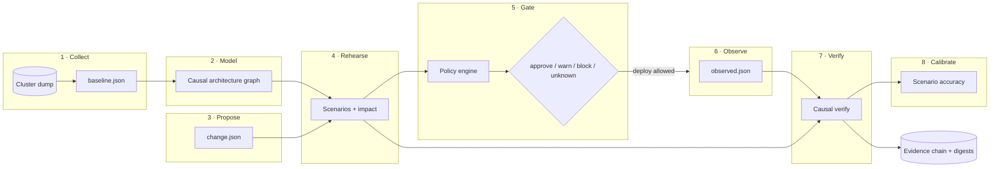
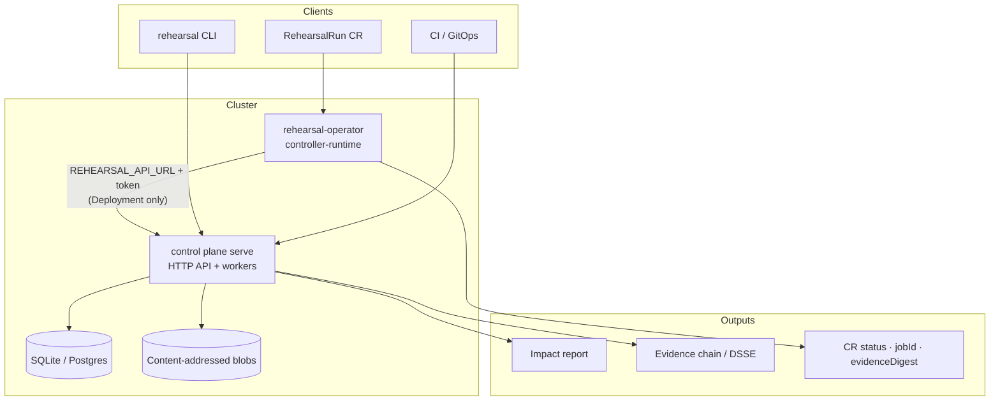
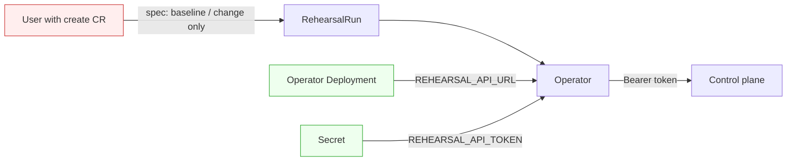

# Architecture Rehearsal

**Know what breaks before you deploy — and prove whether you were right.**

Self-hosted **deterministic pre-deployment failure simulation** and **post-deployment verification control plane**.

[](https://github.com/justrunme/architecture-rehearsal/actions/workflows/ci.yml)
[](https://github.com/justrunme/architecture-rehearsal/releases)
[](https://go.dev/)
[](LICENSE)

**Status: v1.5.3 (flagship complete)** — multi-arch GHCR, Helm chart with CRDs, Kind operator E2E with terminal evidence.

> Graph and rules decide. AI only explains (optional — never in the risk path).  
> Missing data never becomes a false approve.  
> Every production gate decision links to a content-addressed evidence chain.

---

## How it works



**Pipeline (short form):**

```text
Collect → Model → Propose → Rehearse → Gate → Observe → Verify → Calibrate
```

---

## Architecture



### Operator trust boundary



| Source | API URL | Token |
| ------ | ------- | ----- |
| Operator Deployment / Secret | **Yes** | **Yes** |
| `RehearsalRun` CR | **Never** (field removed in v1.5.1) | **Never** |

Run identity: `{namespace}-{name}-{uid8}-g{generation}` — Spec changes create a new run; delete/recreate does not collide with old generations.

---

## Quick start

```bash
git clone https://github.com/justrunme/architecture-rehearsal.git
cd architecture-rehearsal
make demo && make e2e
make build && ./bin/rehearsal version   # 1.5.3
```

### Offline iron path

```bash
./bin/rehearsal snapshot k8s --dir examples/e2e-pipeline/cluster-dump --out baseline.json
./bin/rehearsal change manifests --baseline baseline.json \
  --dir examples/e2e-pipeline/rendered-chart --namespace payments --out change.json
./bin/rehearsal analyze --baseline baseline.json --change change.json --out out --quiet
# exit 3 = block

./bin/rehearsal snapshot k8s --dir examples/e2e-pipeline/observed-dump \
  --phase observed --meta examples/e2e-pipeline/observed-meta.json --out observed.json
./bin/rehearsal verify --report out/latest-report.json --observed observed.json \
  --baseline baseline.json --change change.json

# evidence chain (also written by analyze as out/*/evidence-chain.json)
./bin/rehearsal evidence chain --baseline baseline.json --change change.json \
  --report out/latest-report.json --observed observed.json --out out/chain.json

export REHEARSAL_HMAC_SECRET="$(openssl rand -hex 32)"
./bin/rehearsal evidence sign-dsse --chain out/latest-chain.json --out out/evidence-dsse.json
./bin/rehearsal evidence verify-dsse --envelope out/evidence-dsse.json
```

### Full run lifecycle

```bash
./bin/rehearsal run execute \
  --baseline baseline.json --change change.json --observed observed.json \
  --out out/run.json
```

### Control plane API

```bash
export REHEARSAL_API_TOKEN="$(openssl rand -hex 32)"
export REHEARSAL_API_ORG=my-org

./bin/rehearsal serve --addr :8080 --workdir "$PWD" \
  --db "$PWD/data/rehearsal.db" --blob "$PWD/data/blobs" --async --workers 2

curl -H "Authorization: Bearer $REHEARSAL_API_TOKEN" http://127.0.0.1:8080/v1/version
curl -H "Authorization: Bearer $REHEARSAL_API_TOKEN" http://127.0.0.1:8080/v1/metrics
```

Postgres: set `REHEARSAL_DATABASE_URL` (always wins over `--db`).  
Non-durable local only: `serve --memory --insecure-dev` (still needs `--workdir`).

### Helm + operator

```bash
helm upgrade --install rehearsal deploy/helm/architecture-rehearsal \
  --set api.token="$(openssl rand -hex 32)" \
  --set image.tag=1.5.3 \
  --set operator.enabled=true \
  --set operator.image.tag=1.5.3
# CRD from chart crds/; NetworkPolicy off by default
kubectl get crd rehearsalruns.rehearsal.io
```

Images (multi-arch `linux/amd64` + `linux/arm64`):

- `ghcr.io/justrunme/architecture-rehearsal:1.5.3`
- `ghcr.io/justrunme/architecture-rehearsal-operator:1.5.3`

Manifests: `kubectl apply -k config/operator/` · docs: [docs/operator.md](docs/operator.md) · security: [docs/operator-security.md](docs/operator-security.md).

---

## Capability matrix

| Area | Status |
| ---- | ------ |
| Offline K8s graph collect + edges | **Supported** |
| Fail-closed YAML | **Supported** |
| Causal verify (no global Pending free-pass) | **Supported** |
| Evidence digests + chain | **Supported** |
| DSSE-style sign (HMAC / Ed25519) | **Supported** (not full Sigstore) |
| RehearsalRun lifecycle + async jobs | **Supported** |
| Policy gate (approve/warn/block/unknown) | **Supported** |
| Control plane HTTP API | **Supported** (token + optional OIDC/JWKS) |
| Durable SQL store | **Supported** (SQLite + Postgres) |
| Content-addressed blobs | **Supported** (local FS); S3 path-style reference |
| Job / Audit APIs | **Supported** |
| Hierarchical RBAC + bearer auth | **Supported** (org-scoped) |
| GitHub/GitLab commit status | **Supported** (`rehearsal status`) |
| Calibration engine | **Supported** (org-scoped SQL) |
| Live controller-runtime operator | **Supported** (Helm CRDs, multi-arch GHCR, Kind E2E) |
| Multi-tenant SaaS | **Not supported** (self-hosted multi-org yes) |
| LLM in risk path | **Not supported** |

---

## Exit codes

| Code | Meaning |
| ---: | ------- |
| 0 | approve / verified |
| 1 | warn / diverged |
| 2 | usage / authz |
| 3 | block |
| 4 | unknown / inconclusive |
| 5 | internal error |

---

## Documentation

| Doc | Description |
| --- | ----------- |
| [docs/README.md](docs/README.md) | Documentation index |
| [docs/operator.md](docs/operator.md) | Kubernetes operator install & status |
| [docs/operator-security.md](docs/operator-security.md) | Trust boundary & least privilege |
| [docs/api.md](docs/api.md) | Control plane HTTP API |
| [docs/threat-model.md](docs/threat-model.md) | Threat model |
| [docs/security.md](docs/security.md) | Security notes |
| [docs/slo.md](docs/slo.md) | Service level objectives |
| [docs/runbooks/operations.md](docs/runbooks/operations.md) | Ops runbooks |
| [docs/upgrade.md](docs/upgrade.md) | Upgrade notes |
| [docs/adr/0001-decision-model.md](docs/adr/0001-decision-model.md) | Decision model ADR |
| [CHANGELOG.md](CHANGELOG.md) | Release history |

---

## License

Apache-2.0
