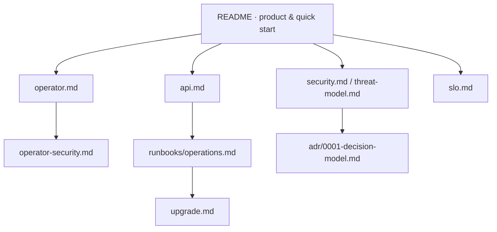

# Documentation

Architecture Rehearsal **v1.5.3** — documentation map.

## Guides

| Document | Audience | Contents |
| -------- | -------- | -------- |
| [../README.md](../README.md) | Everyone | Positioning, diagrams, quick start, capability matrix |
| [operator.md](operator.md) | Platform / SRE | Helm & manifests, CR status, conditions, troubleshooting |
| [operator-security.md](operator-security.md) | Security | Token trust boundary, RBAC, hardening |
| [api.md](api.md) | Integrators | HTTP API, auth, advance semantics |
| [runbooks/operations.md](runbooks/operations.md) | Operators | Deploy, backup, disaster recovery |
| [upgrade.md](upgrade.md) | Operators | Breaking changes & migration notes |

## Security & quality

| Document | Contents |
| -------- | -------- |
| [threat-model.md](threat-model.md) | Assets, adversaries, mitigations |
| [security.md](security.md) | Collector policy, CI permissions |
| [slo.md](slo.md) | Availability & correctness SLOs |
| [adr/0001-decision-model.md](adr/0001-decision-model.md) | approve / warn / block / unknown |

## Product principles

1. **Graph and rules decide** — optional AI is explanatory only, never in the risk path.
2. **Missing data ≠ approve** — exit code `4` / decision `unknown`.
3. **Evidence is content-addressed** — digests bind baseline, change, report, and chain.
4. **Operator trust boundary** — API URL and token come only from Deployment/Secret, never from the CR.

## Version

Docs target **v1.5.3**. See [CHANGELOG.md](../CHANGELOG.md) for release history.  
Do not move published git tags; ship fixes as new versions (`v1.5.4+`).
