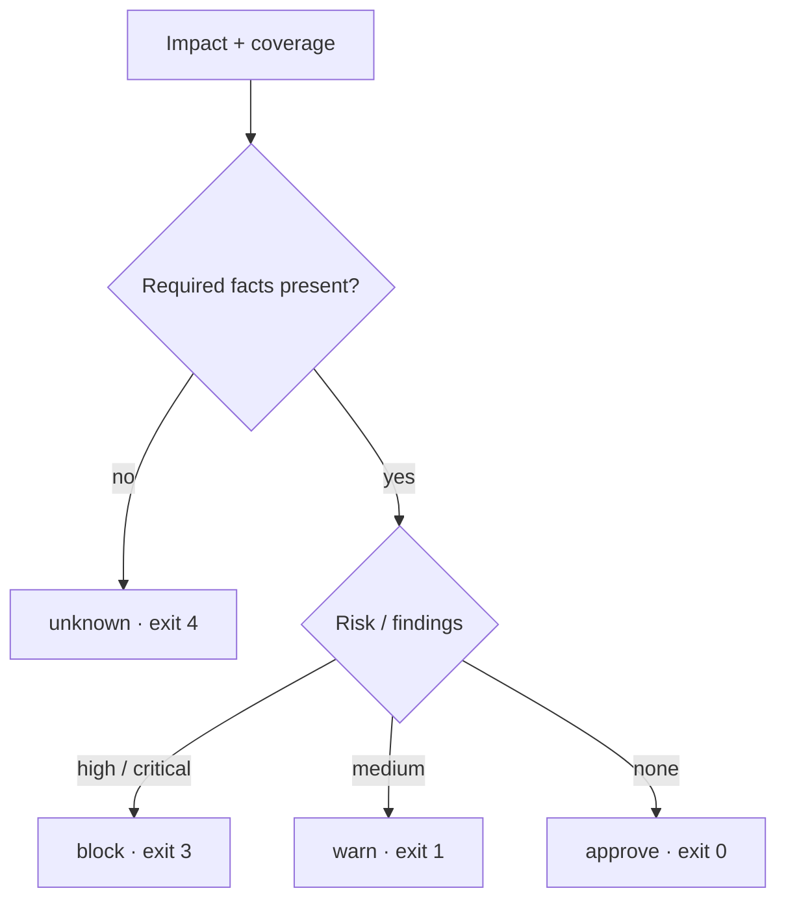

# ADR-0001: approve / warn / block / unknown

## Status

Accepted for Architecture Rehearsal v1.0+ (still current in v1.5.3).

## Context

A change gate that only returns approve/block will **false-approve** when the graph lacks required facts (no PVC list, no metric schema, partial RBAC).

## Decision

Four outcomes:

| Decision | Meaning | Exit |
| -------- | ------- | ---: |
| `approve` | No matched high-risk patterns; required coverage present | 0 |
| `warn` | Medium risk findings | 1 |
| `block` | High/critical findings with evidence | 3 |
| `unknown` | Required data missing — **not safe to approve** | 4 |

Also: exit `2` = validation/authz, `5` = internal error.

## Rule

> Missing data never becomes false `approve`.

## Consequences

CI must treat exit 4 as a failing gate (or explicit `allow_failure` policy).  
Operators fix collectors/RBAC rather than ignoring `unknown`.
