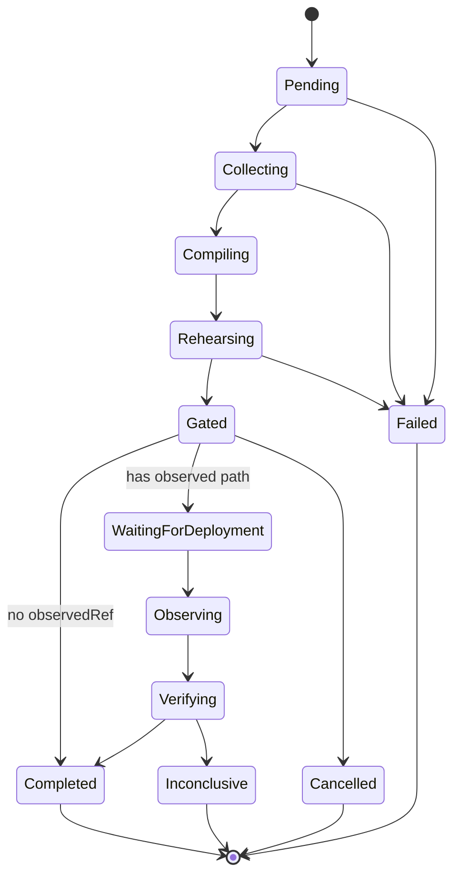

# Control plane API

**Version:** v1.5.3 · Base URL example: `http://localhost:8080`

## Auth

`Authorization: Bearer <token>` required for `/v1/*` (except liveness).

| Mechanism | How |
| --------- | --- |
| Static token | `REHEARSAL_API_TOKEN` (required to start `serve` in production) |
| Multi-token map | `REHEARSAL_API_TOKENS` JSON |
| OIDC | `REHEARSAL_OIDC_ISSUER` + JWKS, RS256 |
| Local dev only | `rehearsal serve --insecure-dev` enables `local-dev` |

Rules:

- Hardcoded `ci` / `viewer-token` **removed**.
- Client `X-Org` does **not** change principal org; tenant is bound to the token.
- Object identity is **`(org, id)`** — cross-tenant reads → 404.
- Duplicate create in same org → **409 Conflict**.

## Serve flags

| Flag | Default | Meaning |
| ---- | ------- | ------- |
| `--workdir` | **required** | Sandbox root (serve refuses without it) |
| `--db` | `<workdir>/rehearsal.db` | SQLite path or `postgres://` URL |
| `--blob` | `<workdir>/blobs` | Content-addressed blob root |
| `--memory` | off | Non-durable in-process store (tests/dev) |
| `--async` | off | Enqueue advances as durable jobs; start workers |
| `--workers` | 1 | Worker count when `--async` |
| `--insecure-dev` | off | Allow `local-dev` token only |

Env: `REHEARSAL_DATABASE_URL` (**wins over `--db`**), `REHEARSAL_BLOB_ROOT`, `REHEARSAL_API_ORG`.

## Endpoints

| Method | Path | Action |
| ------ | ---- | ------ |
| GET | `/healthz` | Liveness |
| GET | `/readyz` | Readiness |
| GET | `/v1/version` | Version + schemaVersion |
| GET | `/v1/metrics` | Prometheus text |
| GET | `/v1/schemas` | Contract catalog |
| POST | `/v1/runs` | Create run (`idempotencyKey`; 409 on conflict) |
| GET | `/v1/runs` | List runs `{items,count,limit}` org-scoped |
| GET | `/v1/runs/{id}` | Get run |
| POST | `/v1/runs/{id}/advance` | Sync execute, cancel, or async enqueue |
| GET | `/v1/runs/{id}/evidence` | Digests + chain/DSSE when present |
| GET | `/v1/jobs` | List jobs (`?runId=&limit=`) |
| GET | `/v1/jobs/{id}` | Job status / attempts / error |
| POST | `/v1/jobs/{id}/cancel` | Cancel pending/leased job |
| POST | `/v1/jobs/{id}/retry` | Requeue failed/cancelled job |
| GET | `/v1/audit` | Tenant audit log |
| POST | `/v1/clusters` | Register cluster (secret ref only) |
| GET | `/v1/clusters` | List clusters |
| POST | `/v1/policies` | Store policy document |
| GET | `/v1/policies` | List policies |
| GET | `/v1/calibration` | Org-scoped scenario quality report |

## Create run

```http
POST /v1/runs
Authorization: Bearer <token>
Content-Type: application/json

{
  "id": "optional-run-id",
  "idempotencyKey": "stable-client-key",
  "baselineRef": "baseline.json",
  "changeRef": "change.json",
  "observedRef": "",
  "scenarios": []
}
```

Relative refs are sandboxed under `--workdir` (stored as absolute paths).  
Paths outside the workdir are rejected.

## Advance semantics

```http
POST /v1/runs/{id}/advance
Content-Type: application/json

{ "async": true, "action": "" }
```

| Mode | Response |
| ---- | -------- |
| Sync (no server `--async`, or `async: false`) | **200** run JSON |
| Async | **202** `{ "runId", "jobId", "status": "queued" }` |
| `action: "cancel"` | Always sync-cancels |

All mutations should send `idempotencyKey` for safe retries.

## Lifecycle phases



## Related

- [operator.md](operator.md) — Kubernetes operator client of this API  
- [runbooks/operations.md](runbooks/operations.md) — deploy & backup  
- [threat-model.md](threat-model.md) — tenant isolation threats  
