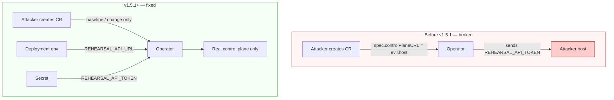

# Operator security model

**Since:** v1.5.1 · **Current:** v1.5.3

## Threat: token exfiltration via CR

**Mitigation:**

1. Field removed from API type and CRD (no Spec field for API URL; typed client ignores unknown keys).
2. Operator reads URL only from `REHEARSAL_API_URL` (Deployment env).
3. Token only from Secret (`secretKeyRef`).
4. NetworkPolicy (optional) restricts egress to control-plane Service + DNS + **explicit** API CIDRs — never `0.0.0.0/0`.

## Least privilege

| Component | Permission |
| --------- | ---------- |
| Operator SA | `get/list/watch/update/patch` on `rehearsalruns` + status/finalizers |
| Operator SA | **No** create/delete of user CRs |
| Operator SA | leases (leader election) + events |
| Token Secret | Mounted only into operator pods |
| Control plane token | Prefer org-scoped operator role, not platform-admin |

## Deployment hardening

- `runAsNonRoot` / `runAsUser: 65532` (distroless nonroot)
- `readOnlyRootFilesystem` + emptyDir `/tmp`
- Drop all capabilities
- Distroless image (`Dockerfile.operator`)
- Leader election for HA (chart default 2 replicas)

## What not to do

- Do not re-add API URL fields on the CR.
- Do not put the API token in CR annotations, labels, or user-owned ConfigMaps.
- Do not run the operator as cluster-admin.
- Do not enable NetworkPolicy with open egress (`0.0.0.0/0`).
