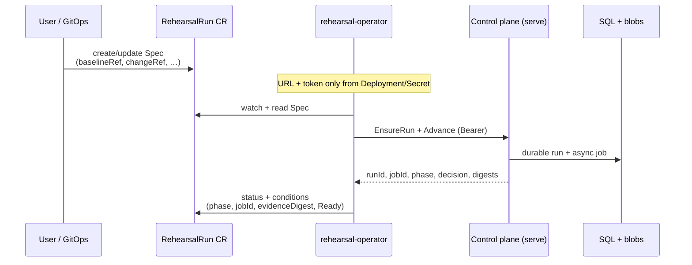
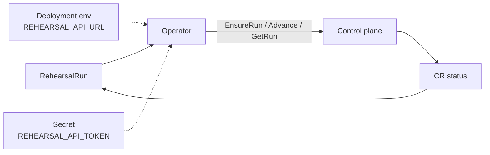

# Kubernetes Operator

**Version:** v1.5.3 · **Images:** multi-arch (`linux/amd64`, `linux/arm64`)

The `rehearsal-operator` reconciles `RehearsalRun` CRs against the Architecture Rehearsal **control plane HTTP API**.

## Architecture





**Trust boundary:** `REHEARSAL_API_URL` and `REHEARSAL_API_TOKEN` are set **only** on the operator Deployment (Secret).  
They are **never** taken from the CR. `spec.controlPlaneURL` was removed in v1.5.1.  
Details: [operator-security.md](./operator-security.md).

## Install

### Helm (recommended)

CRD installs from `deploy/helm/architecture-rehearsal/crds/` on first install.

```bash
export REHEARSAL_API_TOKEN="$(openssl rand -hex 32)"

helm upgrade --install rehearsal deploy/helm/architecture-rehearsal \
  --set api.token="$REHEARSAL_API_TOKEN" \
  --set image.tag=1.5.3 \
  --set operator.enabled=true \
  --set operator.image.tag=1.5.3

kubectl get crd rehearsalruns.rehearsal.io
kubectl get deploy -l 'app.kubernetes.io/name in (architecture-rehearsal,rehearsal-operator)'
```

| Value | Default | Notes |
| ----- | ------- | ----- |
| `operator.enabled` | `false` | Opt-in cluster RBAC |
| `operator.networkPolicy.enabled` | `false` | Enable only with real `kubeAPIServerCIDRs` |
| `operator.replicas` | `2` | Leader election |
| `persistence.enabled` | `true` | SQLite + blobs PVC |

Images:

```text
ghcr.io/justrunme/architecture-rehearsal:1.5.3
ghcr.io/justrunme/architecture-rehearsal-operator:1.5.3
```

### Manifests (kustomize)

```bash
kubectl apply -f config/crd/rehearsal.io_rehearsalruns.yaml
kubectl create secret generic rehearsal-operator-token \
  --from-literal=token="$REHEARSAL_API_TOKEN"
# Edit REHEARSAL_API_URL in config/operator/deployment.yaml if needed
kubectl apply -k config/operator/
```

`config/operator/networkpolicy.yaml` is **optional** and not applied by kustomize by default.  
Set a real API server CIDR before applying (never `0.0.0.0/0`).

## CR example

See [examples/operator/rehearsalrun.yaml](../examples/operator/rehearsalrun.yaml).

```yaml
apiVersion: rehearsal.io/v1beta1
kind: RehearsalRun
metadata:
  name: payments-rollout
spec:
  baselineRef: baselines/prod.json   # path relative to control-plane workdir
  changeRef: changes/payments-v2.json
  async: true
# NEVER set controlPlaneURL — removed for security
```

## Status semantics

| Field | Meaning |
| ----- | ------- |
| `status.observedGeneration` | Last reconciled `metadata.generation` |
| `status.specDigest` | sha256 of Spec (drift detection) |
| `status.controlPlaneRunId` | `{namespace}-{name}-{uid8}-g{generation}` |
| `status.jobId` | Async job id (set once per generation) |
| `status.evidenceDigest` | Chain/report digest when available |
| `status.phase` | Control-plane phase |
| `status.decision` | `approve` · `warn` · `block` · `unknown` |

### Generation / immutability

Changing Spec bumps `metadata.generation`. The operator creates a **new** control-plane run id (`…-g2`, `…-g3`, …) instead of overwriting previous artifacts.

Spec is compared on **every** EnsureRun result (201 / 200 / 409) and after GET. Relative refs match sandboxed absolute paths under the control-plane workdir.

### Conditions

| Type | Meaning |
| ---- | ------- |
| `Accepted` | Spec accepted by operator |
| `Running` | Advance in progress |
| `Ready` | Terminal success (`True`) or still in progress / failed (`False`) |
| `Failed` | Terminal failure or reconcile error |

`lastTransitionTime` updates only when status / reason / message change.

## Kind E2E

CI job `operator-kind-e2e` runs [scripts/kind-operator-e2e.sh](../scripts/kind-operator-e2e.sh):

1. Real `helm upgrade --install` (CRD + control plane + operator)
2. Golden fixtures (rwo-node-loss)
3. Generation 1 → 2, restart without duplicate job, 2 replicas
4. Terminal assertions: `Completed`, `Ready=True`, `decision=block`, non-empty `evidenceDigest`

## Troubleshooting

| Symptom | Check |
| ------- | ----- |
| `REHEARSAL_API_URL required` | Operator Deployment env — not the CR |
| 401 from control plane | Secret token matches `serve` / Helm `api.token` |
| Spec mismatch / immutable | Old run id reused; delete CR or change name; Spec must match |
| Empty `jobId` | Async path; control plane workers; operator logs |
| `Ready=False` + `Failed` | Control-plane message; API logs; fixture paths under workdir |
| NetworkPolicy breaks watch | Leave disabled or set `kubeAPIServerCIDRs` |

## Security

See [operator-security.md](./operator-security.md).
