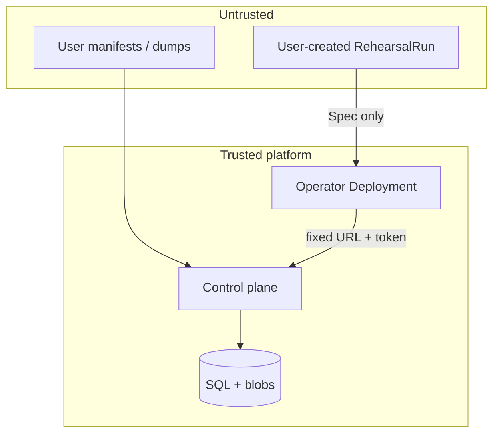

# Threat model

**Scope:** Architecture Rehearsal v1.0 – v1.5.3 (self-hosted control plane + operator)

## Assets

| Asset | Why it matters |
| ----- | -------------- |
| Baseline / observed graphs | Ground truth for prediction & verify |
| Change envelopes | What is about to ship |
| Impact reports & gate decisions | Deploy allow/deny |
| Evidence chain / digests | Non-repudiation of what was analyzed |
| Cluster connection refs | Access to live clusters |
| API tokens / OIDC principals | Tenant authority |

## Trust boundaries

## Adversaries

| Threat | Mitigation |
| ------ | ---------- |
| Baseline substitution | Content digests; chain binds report → baseline/change |
| Observed snapshot forgery | Digest + optional DSSE/Ed25519 |
| Replay of old report | Digests bound to baseline/change; reject mismatch |
| Compromised runner | Non-root image; no inline kubeconfig secrets; short-lived tokens |
| Malicious manifests | Fail-closed YAML; no secret value collection |
| kubectl injection | Fixed resource list; no shell interpolation of user args |
| Secret leakage | Collect never stores Secret data; only references |
| Forged evidence | HMAC/DSSE/Ed25519 (HMAC is not non-repudiation) |
| Tenant escape | Org-scoped authz; no `X-Org` principal rewrite |
| Hardcoded API tokens | Removed; serve requires `REHEARSAL_API_TOKEN` |
| Unsigned OIDC JWT | Rejected (no stub acceptance) |
| CR redirects operator token | No `controlPlaneURL` on Spec (v1.5.1+) |

## Explicit non-goals (current)

- Full multi-tenant SaaS isolation with per-tenant KMS
- Sigstore keyless cosign in CI (documented integration path only)
- Formal cryptographic proof of live cluster state
